<div align="center">


<a href="https://github.com/SAAD-MOMIN-37">

</a>

<br/><br/>


<br/><br/>


</div>

---

<div align="center">

# 👋 Hi, I'm Saad

### CSE (AI/ML) Undergraduate · AI/ML Engineer

**Building practical AI systems that turn data into intelligent solutions.**

📍 India   •   🤖 Machine Learning   •   🧠 Deep Learning   •   ⚡ Generative AI

</div>

---

## `01` — WHO I AM

```python
saad = {
    "identity": "AI/ML Engineer",
    "education": "B.E. CSE (AI/ML) | 2023 - 2027",

    "focus": [
        "Machine Learning",
        "Deep Learning",
        "Data Science",
        "NLP",
        "Generative AI"
    ],

    "build_with": [
        "Python",
        "SQL",
        "Scikit-learn",
        "XGBoost",
        "TensorFlow/Keras",
        "Pandas",
        "NumPy"
    ],

    "engineering": [
        "FastAPI",
        "REST APIs",
        "React",
        "TypeScript",
        "Git",
        "GitHub"
    ],

    "mindset": "Build → Evaluate → Deploy"
}
```

I enjoy building **end-to-end AI/ML applications** — from data preprocessing and model development to API integration, interactive interfaces and deployment.

---

## `02` — WHAT I WORK WITH

<div align="center">

### MACHINE LEARNING

`Classification` · `Regression` · `Model Evaluation` · `Feature Engineering` · `Ensemble Learning`

### DEEP LEARNING

`TensorFlow` · `Keras` · `GRU` · `LSTM` · `Time Series`

### DATA & NLP

`Pandas` · `NumPy` · `SQL` · `EDA` · `Statistics` · `TF-IDF` · `Cosine Similarity`

### AI ENGINEERING

`FastAPI` · `REST APIs` · `React` · `TypeScript` · `Git` · `GitHub`

</div>

---

## `03` — TECH STACK

<div align="center">


<br/><br/>


</div>

---

## `04` — FEATURED PROJECTS

### 🩺 Breast Cancer Prediction System

End-to-end machine learning system for breast cancer classification using supervised learning and ensemble techniques.

**Stack:** `Python` `Scikit-learn` `XGBoost` `Pandas` `NumPy`

**Built around:**

* Data preprocessing and feature preparation
* Multiple ML model evaluation
* Ensemble-based prediction
* Model optimization and evaluation
* API-based prediction workflow

**Repository:**
https://github.com/SAAD-MOMIN-37/Breast-Cancer-Prediction

---

### 📈 Stock Price Prediction System

Full-stack deep learning application combining **GRU + LSTM forecasting** with a FastAPI backend and interactive React/TypeScript frontend.

**Stack:** `TensorFlow/Keras` `GRU` `LSTM` `FastAPI` `React` `TypeScript`

**Built around:**

* Time-series preprocessing
* GRU + LSTM forecasting
* Saved model integration
* REST API prediction workflow
* Interactive forecast configuration
* Full-stack deployment

**Repository:**
https://github.com/SAAD-MOMIN-37/Stock-Price-Prediction

---

### 🎬 Movie Recommendation System

Content-based movie recommendation engine using NLP-based feature representation and similarity scoring.

**Stack:** `Python` `Scikit-learn` `NLP` `TF-IDF` `Cosine Similarity`

**Built around:**

* Text feature engineering
* TF-IDF vectorization
* Cosine similarity
* Content-based recommendation
* Interactive recommendation interface

**Repository:**
https://github.com/SAAD-MOMIN-37/Movie-Recommender-System

---

## `05` — EXPERIENCE

### Machine Learning Intern · Acmegrade

**Aug 2025 — Oct 2025**

Worked on practical machine learning workflows involving data preprocessing, model development, evaluation and applied ML implementation.

---

### Data Science Intern · Saiket Systems

**Jul 2026 — Aug 2026**

Worked on data science and analytical workflows involving data processing, analysis and machine-learning-oriented problem solving.

---

## `06` — ACHIEVEMENTS

<div align="center">

### 🥈 1st Runner-Up

### Smart India Hackathon Internal Hackathon 2026

**AI-Based Smart Logistics & Accessibility Intelligence Platform for NER**

`SIH26002`

<a href="https://sih-2026-olive.vercel.app/">

</a>

</div>

---

## `07` — CURRENT DIRECTION

```text
                    ┌──────────────────┐
                    │  MACHINE LEARNING│
                    └────────┬─────────┘
                             ↓
                    ┌──────────────────┐
                    │  DEEP LEARNING  │
                    └────────┬─────────┘
                             ↓
                    ┌──────────────────┐
                    │   NLP + LLMs    │
                    └────────┬─────────┘
                             ↓
                    ┌──────────────────┐
                    │  GENERATIVE AI  │
                    └────────┬─────────┘
                             ↓
                    ┌──────────────────┐
                    │ PRODUCTION AI   │
                    └──────────────────┘
```

**Long-term focus:** building AI systems that are **accurate, usable, deployable and engineered end-to-end.**

---

## `08` — GITHUB ACTIVITY

<div align="center">


<br/>


</div>

---

## `09` — CONTRIBUTION ACTIVITY

<div align="center">



</div>

---

## `10` — LET'S CONNECT

<div align="center">

<a href="https://www.linkedin.com/in/saad-momin-9a88542bb">

</a>

<a href="https://github.com/SAAD-MOMIN-37">

</a>

<a href="mailto:saadmomin2337@gmail.com">

</a>

</div>

<br/>

<div align="center">

### **BUILD. EVALUATE. DEPLOY.**

**Turning Data Into Intelligent Solutions.**

<br/>


</div>
